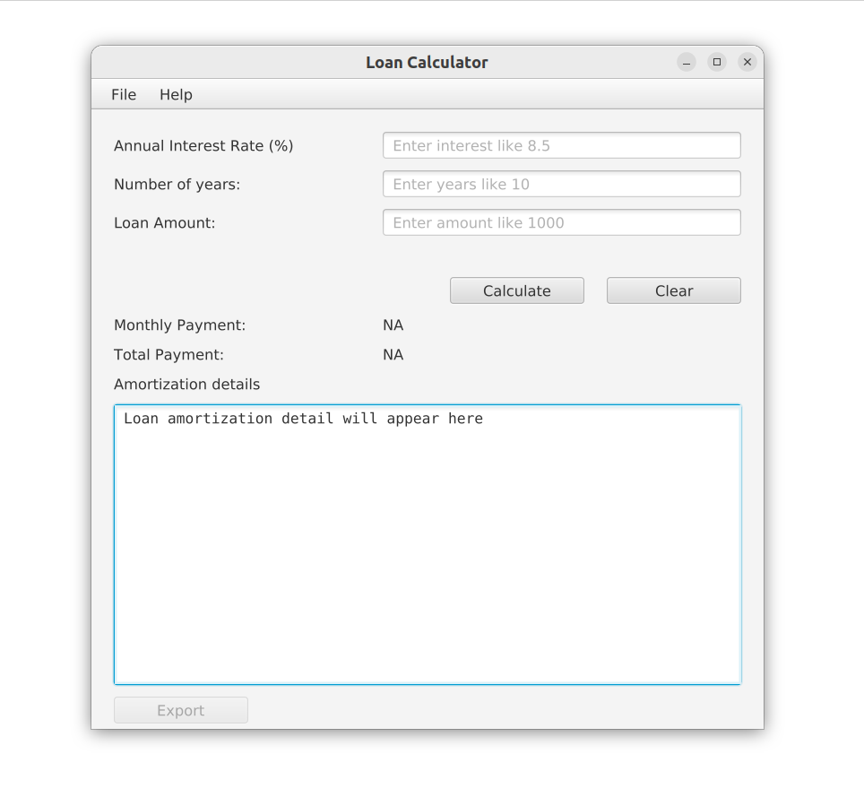

A simple desktop app to calculate loan.

## Todo

* Add locale - x
* highlight required fields on empty - x
* add clern button - x
* add about in menu
* fix window size - x
* view logs - x
* export data - x
* show message box on errors - x
* add validation for integers - x
* add request focus - x
* add option to change compunding period
* add thread support when exporting - x
* add testing support
* add option to save file location
* add tab for logs
* add license
* add icon
* binary files
* new thread for loan amortization calculation